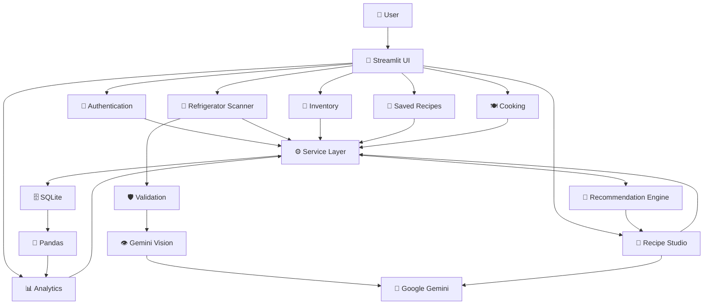
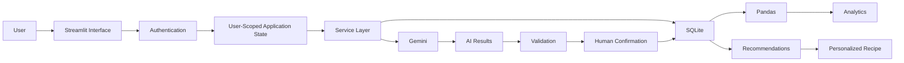
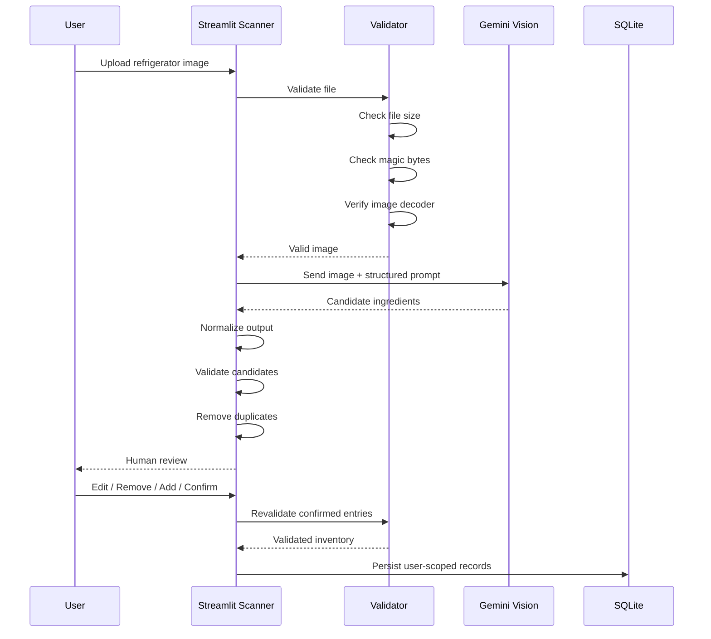
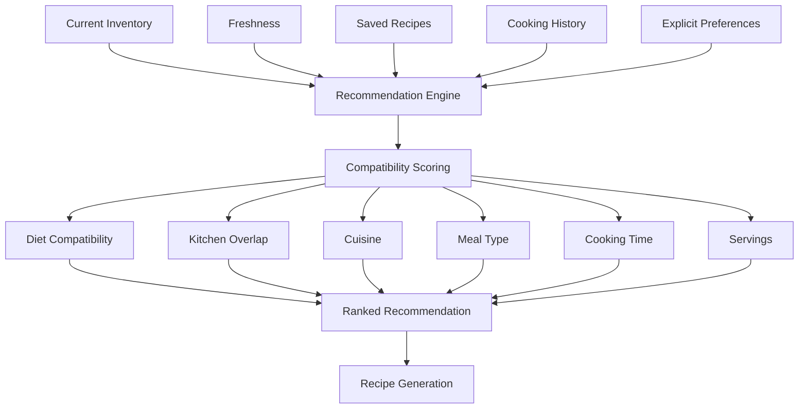
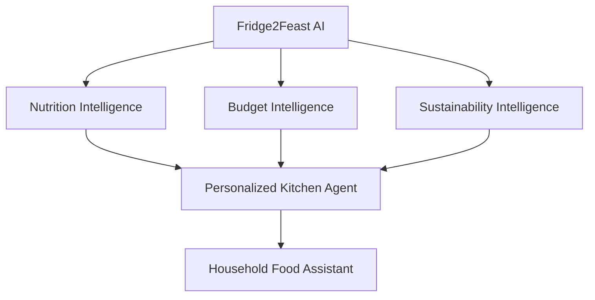

Haan 😭 ab samajh gaya. Tumhe **instructions nahi chahiye**, tumhe **ek single complete README file** chahiye jisme architecture diagrams, terminal-style boxes, badges, tables, flowcharts — **sab already Markdown/Mermaid syntax mein ho**, taaki tum **sirf ek baar copy-paste** karo aur GitHub automatically render kar de.

Important: jo ASCII/mockup maine diya tha, woh screenshot/image nahi tha. Woh **README ke andar code blocks** hain, isliye GitHub par automatically text-art ke form mein dikhenge. Mermaid diagrams bhi GitHub par render ho sakte hain.

### Exactly ye karo

VS Code → `README.md` → **Ctrl+A** → नीचे वाला **पूरा block एक ही बार copy-paste** → Save.

````markdown
# 🍽️ Fridge2Feast AI

> **From Fridge to Feast — an AI-powered kitchen intelligence platform that helps users understand their inventory, prioritize ingredients, generate personalized recipes, and reduce food waste.**

<p align="center">


</p>

<p align="center">

**AI Kitchen Intelligence • Gemini Vision • Personalized Recipes • Food Waste Reduction**

</p>

---

## 🌐 Project Links

| Resource | Link |
|---|---|
| 📦 GitHub Repository | https://github.com/dishasinha2/fridge2feast-ai |
| 🚀 Live Application | **ADD YOUR STREAMLIT URL HERE AFTER DEPLOYMENT** |
| 🤖 AI Platform | Google Gemini |
| 🎨 UI Framework | Streamlit |

---

# 🖥️ `> whoami`

```text
┌──────────────────────────────────────────────────────────────────────────┐
│                         FRIDGE2FEAST AI                                  │
├──────────────────────────────────────────────────────────────────────────┤
│                                                                          │
│  PURPOSE                                                                 │
│  ───────                                                                 │
│  Turn a user's real kitchen inventory into actionable cooking decisions. │
│                                                                          │
│  INPUTS                                                                  │
│  ──────                                                                  │
│  Refrigerator Images • Ingredients • Preferences • Cooking History       │
│                                                                          │
│  INTELLIGENCE                                                            │
│  ────────────                                                            │
│  Gemini Vision • Gemini Text • Freshness Logic • Personalization         │
│                                                                          │
│  OUTPUTS                                                                 │
│  ───────                                                                  │
│  Detected Ingredients • Freshness • Recipes • Recommendations             │
│  Analytics • Saved Meals • Kitchen Rescue Actions                        │
│                                                                          │
│  CORE IDEA                                                               │
│  ─────────                                                               │
│                                                                          │
│             USE WHAT YOU HAVE → BUY LESS → WASTE LESS                    │
│                                                                          │
└──────────────────────────────────────────────────────────────────────────┘
````

---


# 🌱 Overview

**Fridge2Feast AI** is an AI-powered kitchen intelligence application built using:

* Python
* Streamlit
* Google Gemini
* Gemini Vision
* Pandas
* SQLite
* Pillow
* Pytest

The system is designed around a simple idea:

> **The best recipe recommendation starts with what is already inside the user's kitchen.**

Instead of behaving like a generic recipe chatbot, Fridge2Feast AI combines:

```text
REAL INVENTORY
      +
FRESHNESS
      +
USER PREFERENCES
      +
COOKING HISTORY
      +
GEMINI AI
      ↓
PERSONALIZED KITCHEN DECISION
```

The application helps users:

* understand what ingredients they have,
* identify ingredients that should be used soon,
* scan refrigerator images,
* generate recipes using existing ingredients,
* personalize recipes according to preferences,
* save recipes,
* analyze their kitchen activity,
* and reduce unnecessary food purchases.

---

# 🎯 Problem Statement

Food waste is often caused by a decision gap rather than simply a storage problem.

Users may:

* forget what ingredients they have,
* overlook ingredients nearing expiry,
* purchase ingredients they already own,
* struggle to decide what to cook,
* receive generic recipe suggestions,
* and waste partially used ingredients.

Traditional recipe applications usually follow:

```text
Recipe Catalog
      ↓
User chooses recipe
      ↓
User buys ingredients
```

Fridge2Feast AI reverses the workflow:

```text
User's Kitchen
      ↓
Inventory
      ↓
Freshness
      ↓
Preferences
      ↓
AI Feasibility
      ↓
Recipe
```

This creates an **inventory-first cooking experience**.

---

# 💡 Solution

Fridge2Feast AI combines deterministic application logic with generative AI.

```text
                         👤 USER
                            │
                            ▼
                  ┌───────────────────┐
                  │   STREAMLIT UI    │
                  └─────────┬─────────┘
                            │
             ┌──────────────┼──────────────┐
             │              │              │
             ▼              ▼              ▼
        📸 Scanner      🥕 Inventory    🍳 Recipes
             │              │              │
             └──────────────┼──────────────┘
                            ▼
                   ⚙️ SERVICE LAYER
                            │
             ┌──────────────┼──────────────┐
             │              │              │
             ▼              ▼              ▼
        Gemini AI      Business Logic    SQLite
             │              │              │
             └──────────────┼──────────────┘
                            ▼
                    🎯 PERSONALIZATION
                            │
                            ▼
                    📊 ANALYTICS
                            │
                            ▼
                   🍽️ ACTIONABLE MEAL
```

---

# ✨ Key Features

## 🥕 1. Inventory Intelligence

The application maintains user-specific inventory containing:

* ingredient name,
* quantity,
* category,
* freshness information,
* remaining days,
* ownership information.

Freshness is represented using deterministic states:

```text
🟥 USE TODAY
🟧 USE SOON
🟩 FRESH
```

These states influence recommendations.

---

## 📸 2. Gemini Vision Refrigerator Scanner

Users can provide a refrigerator image.

The application validates the uploaded file before sending it to Gemini.

Supported formats:

```text
JPEG
PNG
WebP
```

Validation includes:

```text
Upload
  ↓
File Size Check
  ↓
Magic Byte Validation
  ↓
Pillow Decoder Verification
  ↓
Gemini Vision
  ↓
Structured Output
  ↓
Normalization
  ↓
Validation
  ↓
Human Review
  ↓
Explicit Confirmation
  ↓
SQLite
```

### Human-in-the-loop design

AI predictions are treated as candidates.

The user can:

```text
EDIT
REMOVE
ADD
CANCEL
CONFIRM
```

Only after explicit confirmation is data persisted.

---

## 🍳 3. Personalized Recipe Generation

Recipe generation considers:

```text
Current Inventory
       +
Freshness
       +
Dietary Preference
       +
Cuisine
       +
Meal Type
       +
Spice Level
       +
Serving Count
       +
Cooking Time
       +
User Request
```

The AI is instructed to:

* prioritize ingredients that need attention,
* respect dietary restrictions,
* respect cooking time,
* respect serving requirements,
* maximize current inventory,
* minimize unnecessary purchases,
* clearly separate existing ingredients from additional ingredients.

---

## 🎯 4. Personalization Engine

Recommendations are inventory-first.

The ranking strategy prioritizes:

```text
USE TODAY
    ↓
USE SOON
    ↓
FRESH INVENTORY
    ↓
KITCHEN OVERLAP
    ↓
DIET COMPATIBILITY
    ↓
CUISINE
    ↓
MEAL TYPE
    ↓
COOKING TIME
    ↓
SERVINGS
    ↓
COOKING HISTORY
```

Historical behavior is only used when enough repeated signals exist.

A single cooking action should not automatically become a permanent preference.

---

## 📊 5. Analytics Dashboard

Analytics are generated from authenticated SQLite data and transformed using Pandas.

The pipeline is:

```text
SQLite
  ↓
Authenticated User Query
  ↓
Pandas DataFrame
  ↓
Filtering
  ↓
Aggregation
  ↓
Visualization
```

The dashboard can provide:

* inventory count,
* ingredients needing attention,
* meals cooked,
* saved recipes,
* freshness distribution,
* category distribution,
* cooking history,
* user-specific insights.

Empty states remain truthful.

No fake inventory or fake history is generated.

---

# 🏗️ System Architecture



---

# 🔄 Application Data Flow



---

# 🤖 Gemini AI Architecture

Gemini access is centralized through the application's Gemini client layer.

```text
                    ┌───────────────────────┐
                    │    GEMINI CLIENT      │
                    │   Central AI Layer    │
                    └───────────┬───────────┘
                                │
                 ┌──────────────┴──────────────┐
                 │                             │
                 ▼                             ▼
        ┌─────────────────┐          ┌─────────────────┐
        │  Gemini Vision  │          │   Gemini Text   │
        └────────┬────────┘          └────────┬────────┘
                 │                            │
                 ▼                            ▼
        Ingredient Detection          Recipe Generation
                 │                            │
                 ▼                            ▼
             Validation                  Validation
                 │                            │
                 └────────────┬───────────────┘
                              ▼
                      Application Logic
                              │
                              ▼
                           SQLite
```

The architecture provides:

* centralized Gemini access,
* model fallback handling,
* structured output validation,
* graceful API failure handling,
* reusable client logic,
* mocked AI testing.

---

# 👁️ Computer Vision Pipeline



---

# 🧠 Recipe Intelligence

The recipe engine creates dynamic context instead of sending a generic prompt.

Conceptually:

```text
SYSTEM INSTRUCTIONS
        +
CURRENT INVENTORY
        +
FRESHNESS
        +
USER PREFERENCES
        +
COOKING CONTEXT
        +
EXPLICIT REQUEST
        ↓
     GEMINI
        ↓
STRUCTURED RECIPE
        ↓
APPLICATION VALIDATION
        ↓
USER
```

Example dynamic context:

```text
Inventory:
{actual_inventory}

Freshness:
{freshness_context}

Meal Type:
{meal_type}

Cuisine:
{cuisine}

Diet:
{dietary_preference}

Spice Level:
{spice_level}

Servings:
{serving_count}

Maximum Cooking Time:
{max_cooking_time}

User Request:
{user_request}
```

The AI is instructed to prioritize existing inventory and minimize additional purchases.

---

# 🎯 Personalization Architecture



---

# 📊 Data & Analytics Architecture

```text
                 AUTHENTICATED USER
                         │
                         ▼
                 USER-SCOPED QUERY
                         │
                         ▼
                      SQLite
                         │
                         ▼
                  Pandas DataFrame
                         │
             ┌───────────┴───────────┐
             │                       │
             ▼                       ▼
      Freshness Analysis       Category Analysis
             │                       │
             └───────────┬───────────┘
                         ▼
                  Streamlit Charts
                         │
                         ▼
                  Dashboard Insights
```

The application avoids mixing records across users by applying user ownership at the service layer.

---

# 🔐 Security & User Isolation

User-specific records are accessed through the authenticated user's ID.

```text
Authenticated User
        │
        ▼
 current_user.id
        │
        ▼
 User-Scoped Service
        │
        ▼
 SQLite Query
        │
        ▼
 User's Records
```

User-scoped data includes:

* inventory,
* saved recipes,
* cooking history,
* recommendations,
* analytics.

### AI does not directly persist database records.

The controlled pipeline is:

```text
Gemini
  ↓
AI Candidate
  ↓
Normalize
  ↓
Validate
  ↓
Human Confirmation
  ↓
SQLite
```

---

# 🛠️ Technology Stack

| Layer            | Technology                | Purpose                           |
| ---------------- | ------------------------- | --------------------------------- |
| UI               | Streamlit                 | Interactive web application       |
| Language         | Python                    | Application logic                 |
| AI               | Google Gemini             | Generative intelligence           |
| Vision           | Gemini Vision             | Ingredient detection              |
| Data             | Pandas                    | Data transformation and analytics |
| Database         | SQLite                    | Persistent user data              |
| Image Processing | Pillow                    | Image validation                  |
| Testing          | Pytest                    | Automated testing                 |
| Version Control  | Git                       | Source control                    |
| Repository       | GitHub                    | Open-source project hosting       |
| Deployment       | Streamlit Community Cloud | Cloud hosting                     |
| Documentation    | Markdown + Mermaid        | Technical documentation           |

---

# 📁 Project Structure

```text
fridge2feast-ai/
│
├── app.py
│
├── components/
│   ├── auth.py
│   ├── dashboard.py
│   ├── scanner.py
│   ├── analytics.py
│   ├── recipes.py
│   ├── recipe_studio.py
│   ├── kitchen.py
│   ├── cooking.py
│   ├── saved.py
│   └── ...
│
├── services/
│   ├── gemini_client.py
│   ├── vision_service.py
│   ├── recipe_service.py
│   ├── recommendation_service.py
│   ├── auth_service.py
│   └── ...
│
├── models/
│   ├── user.py
│   ├── ingredient.py
│   └── recipe.py
│
├── utils/
│   ├── database.py
│   ├── validation.py
│   ├── calculations.py
│   └── ...
│
├── tests/
│   ├── test_auth.py
│   ├── test_vision.py
│   ├── test_scanner_pipeline.py
│   ├── test_recipes.py
│   ├── test_recommendation_service.py
│   ├── test_analytics_pipeline.py
│   ├── test_analytics_routing.py
│   └── ...
│
├── .streamlit/
│   ├── config.toml
│   └── secrets.toml
│
├── requirements.txt
├── README.md
├── architecture.md
├── PROJECT_CONTRACT.md
└── .gitignore
```

> `secrets.toml`, API keys, local databases, Python cache files, and virtual environments must not be committed to the public repository.

---

# 🧪 Testing

The project uses automated testing to verify core application boundaries.

Current test coverage includes:

```text
Authentication
        ✓

User Isolation
        ✓

Inventory
        ✓

Recipe Workflow
        ✓

Gemini Client
        ✓

Gemini Fallback
        ✓

Vision Validation
        ✓

Scanner Pipeline
        ✓

Recommendation Engine
        ✓

Analytics Pipeline
        ✓

Analytics Routing
        ✓

Security Boundaries
        ✓
```

Run tests:

```bash
python -m pytest tests/ -v
```

Compile the application:

```bash
python -m compileall .
```

Check Git changes:

```bash
git diff --check
```

---

# 🔬 Research & Engineering Decisions

## 1. Inventory-first recommendation

Traditional recipe applications:

```text
Recipe
  ↓
User
```

Fridge2Feast AI:

```text
User Inventory
      ↓
Freshness
      ↓
Feasibility
      ↓
Preferences
      ↓
Recipe
```

This approach is intended to make recommendations more actionable and reduce unnecessary ingredient purchases.

---

## 2. Deterministic freshness logic

Freshness is a decision-critical attribute.

Therefore, the application uses deterministic logic to classify ingredients:

```text
Ingredient
    ↓
Freshness Calculation
    ↓
┌─────────────┬─────────────┬─────────────┐
│ USE TODAY   │  USE SOON   │    FRESH    │
└─────────────┴─────────────┴─────────────┘
```

These states feed the recommendation system.

---

## 3. Human-in-the-loop computer vision

Vision models can make uncertain predictions.

Therefore:

```text
AI Prediction
      ≠
Trusted Database Record
```

Instead:

```text
AI Prediction
      ↓
Validation
      ↓
Human Review
      ↓
Confirmation
      ↓
Database
```

This prevents unreviewed AI output from becoming persistent inventory.

---

## 4. Gemini + deterministic logic

Gemini is responsible for tasks where generative reasoning is useful:

* image understanding,
* contextual recipe generation,
* natural-language interpretation.

Deterministic Python logic handles:

* validation,
* freshness classification,
* ownership,
* ranking,
* database writes,
* safety boundaries.

This creates a hybrid architecture rather than delegating the entire application to an LLM.

---

## 5. Pandas for analytics

Pandas is used as the transformation layer between persistent records and visualization.

```text
SQLite
  ↓
Pandas
  ↓
Transform
  ↓
Aggregate
  ↓
Visualize
```

---

## 6. Explicit AI triggers

AI calls are associated with deliberate user actions.

Examples:

```text
Analyze Image
Generate Recipe
```

The application avoids automatically calling Gemini on every Streamlit rerun.

This reduces:

* unnecessary API calls,
* latency,
* quota consumption,
* accidental repeated generation.

---

# 🧠 Prompt Engineering Strategy

The application uses dynamic prompt context.

The prompt structure follows:

```text
ROLE
 ↓
CONTEXT
 ↓
USER DATA
 ↓
CONSTRAINTS
 ↓
TASK
 ↓
OUTPUT FORMAT
```

### Example

```text
ROLE
You are Fridge2Feast AI, an inventory-aware kitchen assistant.

CONTEXT
The following ingredients are currently available.

INVENTORY
{inventory}

FRESHNESS
{freshness}

USER PREFERENCES
{preferences}

CONSTRAINTS
- Respect dietary restrictions.
- Prioritize ingredients needing attention.
- Respect maximum cooking time.
- Respect serving count.
- Prefer existing inventory.
- Minimize additional ingredients.

TASK
Create a personalized recipe.

OUTPUT
Return a structured recipe with:
- title
- servings
- cooking time
- ingredients
- steps
- existing kitchen ingredients
- additional ingredients
```

This allows the same Gemini model to behave as a specialized kitchen intelligence engine.

---

# 🖥️ Local Installation

## Requirements

```text
Python 3.11+
Git
Google Gemini API Key
Modern Browser
```

Clone the repository:

```bash
git clone https://github.com/dishasinha2/fridge2feast-ai.git
cd fridge2feast-ai
```

Create a virtual environment:

### Windows

```powershell
python -m venv .venv
.\.venv\Scripts\Activate.ps1
```

Install dependencies:

```powershell
pip install -r requirements.txt
```

Run:

```powershell
streamlit run app.py
```

---

# 🔑 Configuration

Create:

```text
.streamlit/secrets.toml
```

Add:

```toml
GEMINI_API_KEY = "YOUR_GEMINI_API_KEY"
```

Never commit this file.

The repository should contain:

```text
.streamlit/secrets.toml
```

in `.gitignore`.

---

# ☁️ Deployment

## Streamlit Community Cloud

Recommended deployment configuration:

```text
Repository:
dishasinha2/fridge2feast-ai

Branch:
main

Main file:
app.py

Python:
3.11

Secret:
GEMINI_API_KEY
```

### Deployment Flow

```text
GitHub
   ↓
Streamlit Community Cloud
   ↓
Select Repository
   ↓
Select main Branch
   ↓
Select app.py
   ↓
Configure GEMINI_API_KEY
   ↓
Deploy
   ↓
Live Streamlit Application
```

After successful deployment, replace:

```text
ADD YOUR STREAMLIT URL HERE
```

at the top of this README with the actual live URL.

---

# 🎬 Recommended Demo Flow

For evaluation, the following sequence demonstrates the complete architecture:

```text
┌─────────────────────────────────────────┐
│              DEMO FLOW                  │
├─────────────────────────────────────────┤
│                                         │
│  01  Open Dashboard                     │
│       ↓                                 │
│  02  Show Inventory KPIs                │
│       ↓                                 │
│  03  Show Freshness Alerts              │
│       ↓                                 │
│  04  Open Scanner                       │
│       ↓                                 │
│  05  Upload Refrigerator Image          │
│       ↓                                 │
│  06  Gemini Vision Analysis             │
│       ↓                                 │
│  07  Review AI Results                  │
│       ↓                                 │
│  08  Confirm Inventory                  │
│       ↓                                 │
│  09  Open Recipe Studio                 │
│       ↓                                 │
│  10  Select Preferences                 │
│       ↓                                 │
│  11  Generate Personalized Recipe       │
│       ↓                                 │
│  12  Save Recipe                        │
│       ↓                                 │
│  13  Open Analytics                     │
│       ↓                                 │
│  14  Show Real Data Visualizations      │
│       ↓                                 │
│  15  Demonstrate Logout                 │
│       ↓                                 │
│  16  Login as Different User            │
│       ↓                                 │
│  17  Demonstrate Data Isolation         │
│                                         │
└─────────────────────────────────────────┘
```

---

# ⚠️ Limitations

Current limitations include:

1. Gemini Vision accuracy depends on image quality and model availability.
2. AI-generated recipes require application-side validation.
3. SQLite is suitable for a capstone application but is not ideal for high-concurrency production workloads.
4. Live Gemini behavior depends on API availability and quota.
5. Cloud deployment should be manually validated after configuration.
6. The recommendation engine currently focuses on the user's saved recipes and actionable kitchen-rescue guidance instead of a large external recipe catalog.

---

# 🚀 Future Scope

## Phase 2

```text
Barcode Scanning
      ↓
Expiry Date OCR
      ↓
Nutrition Estimation
      ↓
Grocery Price Comparison
      ↓
Smart Shopping List
      ↓
Expiry Notifications
```

## Phase 3



---

# 🏆 Evaluation Rubric Mapping

| Evaluation Category                     | Max | Fridge2Feast AI                                                                               |
| --------------------------------------- | --: | --------------------------------------------------------------------------------------------- |
| Technical Implementation & Architecture |  25 | Streamlit architecture, session state, forms, SQLite, Pandas pipelines, validation, testing   |
| AI Integration & Prompt Engineering     |  20 | Gemini API, Gemini Vision, dynamic context, structured outputs, personalization               |
| UI/UX & Data Visualization              |  20 | Dashboard, responsive navigation, KPI cards, charts, filters, interactive workflows           |
| Deployment & Cloud Engineering          |  15 | Streamlit Community Cloud, requirements configuration, secrets management                     |
| Open-Source Branding                    |  10 | Professional GitHub README, badges, architecture, installation, deployment, testing, research |
| System Design & Documentation           |  10 | Mermaid architecture, data flow, AI pipeline, security model, engineering decisions           |

**Total: 100 Points**

---

# 📋 Final Submission Checklist

```text
┌─────────────────────────────────────────────────────────────────┐
│                   FRIDGE2FEAST AI                               │
│                    FINAL CHECKLIST                              │
├─────────────────────────────────────────────────────────────────┤
│                                                                 │
│ CODE                                                            │
│ [ ] Application starts successfully                             │
│ [ ] No syntax errors                                            │
│ [ ] Session state verified                                      │
│ [ ] Forms verified                                              │
│ [ ] Pandas pipeline verified                                    │
│                                                                 │
│ AI                                                              │
│ [ ] Gemini text generation works                                │
│ [ ] Gemini Vision works                                         │
│ [ ] Dynamic prompts work                                        │
│ [ ] AI output validation works                                  │
│ [ ] Human confirmation works                                    │
│                                                                 │
│ UI                                                              │
│ [ ] Dashboard polished                                          │
│ [ ] KPI cards working                                           │
│ [ ] Charts working                                               │
│ [ ] Navigation working                                          │
│ [ ] Mobile layout checked                                       │
│                                                                 │
│ SECURITY                                                        │
│ [ ] API key NOT committed                                       │
│ [ ] secrets.toml NOT committed                                  │
│ [ ] .env NOT committed                                          │
│ [ ] __pycache__ NOT committed                                   │
│ [ ] User isolation tested                                       │
│                                                                 │
│ TESTING                                                         │
│ [ ] pytest passing                                               │
│ [ ] compileall passing                                          │
│ [ ] git diff --check passing                                    │
│ [ ] Manual smoke test completed                                 │
│                                                                 │
│ DEPLOYMENT                                                      │
│ [ ] Streamlit deployment successful                              │
│ [ ] Gemini secret configured                                    │
│ [ ] Live URL works                                              │
│ [ ] Scanner tested                                               │
│ [ ] Recipe generation tested                                    │
│ [ ] Analytics tested                                            │
│                                                                 │
│ DOCUMENTATION                                                   │
│ [ ] README complete                                              │
│ [ ] Architecture documented                                     │
│ [ ] Data flow documented                                        │
│ [ ] AI pipeline documented                                      │
│ [ ] Research decisions documented                               │
│ [ ] Live URL added                                               │
│                                                                 │
└─────────────────────────────────────────────────────────────────┘
```

---

# 🤝 Contributing

Contributions are welcome.

```bash
git checkout -b feature/my-improvement

# Make changes

python -m pytest tests/ -v

git diff --check

git add .

git commit -m "feat: improve kitchen intelligence"

git push origin feature/my-improvement
```

Open a Pull Request after pushing the branch.

---

# 📜 License

This project is released under the MIT License.

---

# 🍽️ Fridge2Feast AI

```text
╔══════════════════════════════════════════════════════════════════════╗
║                                                                      ║
║                         FRIDGE2FEAST AI                              ║
║                                                                      ║
║                INVENTORY → INTELLIGENCE → ACTION                     ║
║                                                                      ║
║                    USE WHAT YOU HAVE                                 ║
║                           ↓                                          ║
║                     COOK SMARTER                                     ║
║                           ↓                                          ║
║                       WASTE LESS                                     ║
║                                                                      ║
╚══════════════════════════════════════════════════════════════════════╝
```

> **Fridge2Feast AI turns the refrigerator from a place where ingredients are forgotten into an intelligent kitchen assistant that helps users decide what to use, what to cook, and what to save.**

---

<p align="center">

**Built with ❤️ using Python, Streamlit, Pandas, SQLite and Google Gemini AI**

बस एक चीज़ बाद में बदलनी है: deployment हो जाने पर `ADD YOUR STREAMLIT URL HERE` की जगह actual live URL डालना।
